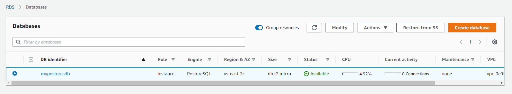
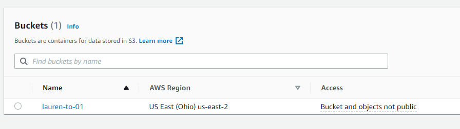
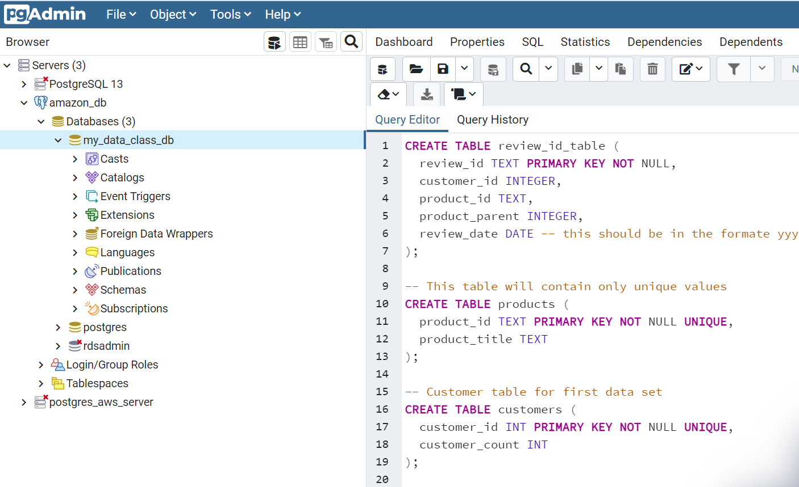
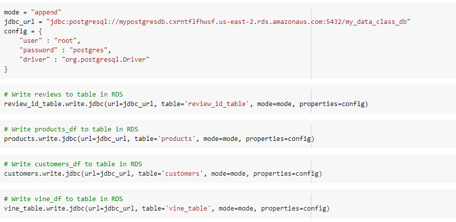
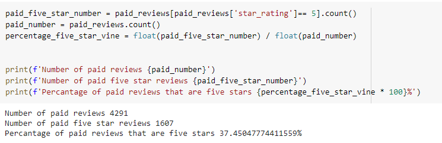
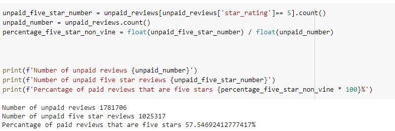

# Amazon Vine ETL

## Project Summary

Big Data ETL using AWS RDS and PostgreSQL. Used PySpark to investigate whether Amazon Vine reviews are free of bias answering the question, 'Are Vine reviews trustworthy?'

"Amazon Vine invites the most trusted reviewers on Amazon to post opinions about new and pre-release items to help their fellow customers make informed purchase decisions. Amazon invites customers to become Vine Voices based on their reviewer rank, which is a reflection of the quality and helpfulness of their reviews as judged by other Amazon customers. Amazon provides Vine members with free products that have been submitted to the program by participating vendors." - Amazon Vine

## Tools
- PySpark
- AWS RDS/S3
- Google Colab
- PostgreSQL/pgAdmin
- ETL

## Data Source

Amazon customer Reviews Dataset. (n.d.). Retrieved April 08, 2021, from: [https://s3.amazonaws.com/amazon-reviews-pds/readme.html](https://s3.amazonaws.com/amazon-reviews-pds/readme.html). 

# Process
1. Used the furnished sql schema to create tables in PostgreSQL and RDS database. 
- Created AWS RDS and S3 bucket. 

- Set up server connection to RDS, and created production-ready tables in pgAdmin. 

- Created DataFrames to match tables from two Amazon customer review datasets with over 1.5M rows.
- Extracted** datasets into Google Colab
- Transformed** the dataset to fit the tables in the [schema file](../Resources/schema.sql)
- Loaded** the DataFrames that correspond to tables into an RDS instance. 

2. Analyzed whether reviews from Amazon's Vine program are trustworthy using PySpark.

## Results
5-star Reviews From member Vine Reviewers

5-star Reviews non-member Vine Reviewers

## Findings
37.4% of five-star reviews are among reviewers that are not part of the Vine program, whereas 57.5% of five-star reviews are from reviewers that are Vine members. This shows that there is a positivity bias for reviews from Vine members, likely due to free products provided by Amazon in return for their review.

Given more time, I would also analyze statistical distributions like mean, median and mode of the star rating across Vine program segments. 

